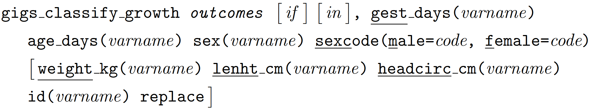

# gigs: Fetal, neonatal and infant growth assessment in Stata
<!-- badges: start -->
[](https://www.repostatus.org/#active)
<!-- badges: end -->

## About
Produced as part of the Guidance for International Growth Standards (GIGS) 
project, `gigs` provides a single, simple interface for working with the WHO 
Child Growth Standards and outputs from the INTERGROWTH-21<sup>st</sup> project.
You will find functions for converting between anthropometric measures (e.g. 
weight or length) to z-scores and centiles, and the inverse. Also included is a 
command for classifying newborn and infant growth according to published 
z-score/centile cut-offs.

## Installation
The `gigs` package is available for Stata version 16 and over. You can install
the development version of `gigs` from GitHub using the 
[`github` module](https://haghish.github.io/github/) for Stata:
```stata
. github install lshtm-gigs/gigs-stata
```

Alternatively, you can download a stable release of your choice from GitHub 
using the `net install` command from Stata. Simply go to the **stable release**
of `gigs` that  you want to download from the 
[releases](https://github.com/lshtm-gigs/gigs-stata/releases/) page on GitHub, 
and download the zipped archive. Unzip this downloaded archive. Within this 
unzipped folder will be another folder, inside which will be the `.ado`/`.dta` 
files needed for `gigs` to work. Put the path to the folder containing the 
`.ado`/`.dta` files in the `from()` option of `net install`, and Stata will
install the necessary files.
```stata
. net install gigs, from("directory/of/unzipped/folder/with/ado/files")
```

## Available standards
* `ig_nbs` - INTERGROWTH-21<sup>st</sup> standards for newborn size
  <details>
  <summary>
  Component standards
  </summary>

  | Acronym  | Description                                | Unit  | `gest_days()` range |
  |----------|--------------------------------------------|-------|---------------------|
  | `wfga`   | Weight-or-gestational age                  | kg    | 168 to 300 days     |
  | `lfga`   | Length-for-gestational age                 | cm    | 168 to 300 days     |
  | `hcfga`  | Head circumference-for-gestational age     | cm    | 168 to 300 days     |
  | `wlrfga` | Weight-to-length ratio-for-gestational age | kg/cm | 168 to 300 days     |
  | `ffmfga` | Fat-free mass-for-gestational age          | kg    | 266 to 294 days     |
  | `bfpfga` | Body fat percentage-for-gestational age    | %     | 266 to 294 days     |
  | `fmfga`  | Fat mass-for-gestational age               | kg    | 266 to 294 days     |

  </details>
- `ig_png` - INTERGROWTH-21<sup>st</sup> standards for postnatal growth in
  preterm infants
  <details>
  <summary>
  Component standards
  </summary>
  
  | Acronym | Description                | Unit | `xvar()` range      |
  |---------|----------------------------|------|---------------------|
  | `wfa`   | weight-for-age             | kg   | 27 to ≤64 weeks PMA |
  | `lfa`   | length-for-age             | cm   | 27 to ≤64 weeks PMA |
  | `hcfa`  | head circumference-for-age | cm   | 27 to ≤64 weeks PMA |
  | `wfl`   | weight-for-length          | kg   | 35 to 65 cm         |

  </details>
* `ig_fet` - INTERGROWTH-21<sup>st</sup> fetal standards
  <details><summary>Component standards</summary>

  | Acronym   | Description                                                  | Unit  | `x` range       |
  |-----------|--------------------------------------------------------------|-------|-----------------|
  | `hcfga`   | head circumference-for-GA                                    | mm    | 98 to 280 days  |
  | `bpdfga`  | biparietal diameter-for-GA                                   | mm    | 98 to 280 days  |
  | `acfga`   | abdominal circumference-for-GA                               | mm    | 98 to 280 days  |
  | `flfga`   | femur length-for-GA                                          | mm    | 98 to 280 days  |
  | `ofdfga`  | occipito-frontal diameter for-GA                             | mm    | 98 to 280 days  |
  | `efwfga`  | estimated fetal weight-for-GA                                | grams | 154 to 280 days |
  | `sfhfga`  | symphisis-fundal height-for-GA                               | mm    | 112 to 294 days |
  | `crlfga`  | crown-rump length-for-GA                                     | mm    | 58 to 105 days  |
  | `gafcrl`  | GA-for-crown-rump length                                     | days  | 15 to 95 mm     |
  | `gwgfga`  | gestational weight gain-for-GA                               | kg    | 98 to 280 days  |
  | `pifga`   | pulsatility index-for-GA                                     |       | 168 to 280 days |
  | `rifga`   | resistance index-for-GA                                      |       | 168 to 280 days |
  | `sdrfga`  | systolic/diastolic ratio-for-GA                              |       | 168 to 280 days |
  | `tcdfga`  | transcerebellar diameter-for-GA                              | mm    | 98 to 280 days  |
  | `gaftcd`  | GA-for-transcerebellar diameter                              | days  | 12-55 mm        |
  | `poffga`  | parietal-occipital fissure-for-GA                            | mm    | 105 to 252 days |
  | `sffga`   | Sylvian fissue-for-GA                                        | mm    | 105 to 252 days |
  | `avfga`   | anterior horn of the lateral ventricle-for-GA                | mm    | 105 to 252 days |
  | `pvfga`   | atrium of the posterior horn of the lateral ventricle-for-GA | mm    | 105 to 252 days |
  | `cmfga`   | cisterna magna-for-GA                                        | mm    | 105 to 252 days |
  | `hefwfga` | Hadlock estimated fetal weight-for-GA                        | g     | 126 to 287 days |
  
  </details>
- `who_gs` - WHO Child Growth Standards for term infants
  <details>
  <summary>
  Component standards
  </summary>
  
  | Acronym | Description                  | Unit             | `xvar()` range  |
  |---------|------------------------------|------------------|-----------------|
  | `wfa`   | weight-for-age               | kg               | 0 to 1856 days  |
  | `bfa`   | BMI-for-age                  | kg/m<sup>2</sup> | 0 to 1856 days  |
  | `lhfa`  | length/height-for-age        | cm               | 0 to 1856 days  |
  | `hcfa`  | head circumference-for-age   | cm               | 0 to 1856 days  |
  | `wfl`   | weight-for-length            | kg               | 45 to 110 cm    |
  | `wfh`   | weight-for-height            | kg               | 65 to 120 cm    |
  | `acfa`  | arm circumference-for-age    | cm               | 91 to 1856 days |
  | `ssfa`  | subscapular skinfold-for-age | mm               | 91 to 1856 days |
  | `tsfa`  | triceps skinfold-for-age     | mm               | 91 to 1856 days |

  </details>

## Conversion functions
Each conversion function has similar syntax. The main function call determines
the set of standards in use, the `acronym` parameter specifies which component 
standard is being used, and the `conversion` parameter specifies the type of 
conversion you wish to perform. This `conversion` parameter can take one of four
values: `"v2z"` (value-to-z-score), `"v2c"` (value-to-centile), `"z2v"` 
(z-score-to-value), `"c2v"` (centile-to-value). The `sex()` and `sexcode()` 
options supply the non-fetal functions with sex data - without this, these
sex-specific growth standards cannot be applied.

### INTERGROWTH-21<sup>st</sup> Newborn Size standards, including very preterm
This function can be used to convert between measurements and 
z-scores/centiles in each of the INTERGROWTH-21<sup>st</sup> Newborn Size
Standards.


The **extend** option, when specified, allows the function to use extrapolated
versions of these INTERGROWTH-21<sup>st</sup> standards which can take 
gestational ages from 154 to 314 days (22<sup>+0</sup> to <sup>44+6</sup> weeks) 
when `acronym` is one of `"wfga"`, `"lfga"`, or `"hcfga"`. Our process for 
extrapolating these standards is documented 
[here](https://docs.ropensci.org/gigs/articles/extending-ig-nbs.html).

### INTERGROWTH-21<sup>st</sup> Postnatal Growth standards
This function can be used to convert between measurements and z-scores/centiles
in each of the INTERGROWTH-21<sup>st</sup> Postnatal Growth of Preterm Infants
Standards.


### INTERGROWTH-21<sup>st</sup> Fetal Growth standards
This function can be used to convert between measurements and z-scores/centiles
in each of the INTERGROWTH-21<sup>st</sup> Fetal standards.


### WHO Child Growth Standards
This function can be used to convert between measurements and z-scores/centiles
in each of the WHO Child Growth Standards.


### Classification command
The `gigs_classify_growth` command is used to classify infant growth according to 
published cut-offs. These publications are discussed in the attached [paper](). 



The **`outcome`** argument is used to pick specific growth analyses, or you can run
all growth analyses by using **`all`**. 

#### Available growth outcomes

* **`all`** - Generate variables for all growth outcomes
* **`sfga`** - Generate variables for size for gestational age
  <details>
  <summary>
  Values and labels for generated variables <code>sfga</code> and <code>sfga_severe</code>
  </summary>
  
  | Value | Meaning                               | Centile range                      |
  |-------|---------------------------------------|------------------------------------|
  | -2    | Severely small for gestational age    | <3<sup>rd</sup>                    |
  | -1    | Small for gestational age (SGA)       | <10<sup>th</sup>                   |
  | 0     | Appropriate for gestational age (AGA) | 10<sup>th</sup> to 90<sup>th</sup> |
  | 1     | Large for gestational age (LGA)       | \>90<sup>th</sup>                  |

  </details>
* **`svn`** - Generate variables for small vulnerable newborns
  <details>
  <summary>
  Values and labels for generated variable <code>svn</code>
  </summary>
  
  | Value | Meaning     | Term Status | Centile range                      |
  |-------|-------------|-------------|------------------------------------|
  | -4    | Preterm SGA | Preterm     | <10<sup>th</sup>                   |
  | -3    | Preterm AGA | Preterm     | 10<sup>th</sup> to 90<sup>th</sup> |
  | -2    | Preterm LGA | Preterm     | \>90<sup>th</sup>                  |
  | -1    | Term    SGA | Term        | <10<sup>th</sup>                   |
  | 0     | Term    AGA | Term        | 10<sup>th</sup> to 90<sup>th</sup> |
  | 1     | Term    LGA | Term        | \>90<sup>th</sup>                  |

  </details>
* **`stunting`** - Generate variables for stunting
  <details>
  <summary>
  Values and labels for generated variables <code>stunting</code> and <code>stunting_outliers</code>
  </summary>
  
  | Value | Meaning         | Z-score range |
  |-------|-----------------|---------------|
  | -2    | Severe stunting | -5 to -3      |
  | -1    | Stunting        | -3 to -2      |
  | 0     | Not stunting    | -2 to 5       |
  | -10   | Implausible     | \<-5 or \>5   |

  </details>
* **`wasting`** - Generate variables for wasting
  <details>
  <summary>
  Values and labels for generated variables <code>wasting</code> and <code>wasting_outliers</code>
  </summary>
  
  | Value | Meaning        | Z-score range |
  |-------|----------------|---------------|
  | -2    | Severe wasting | -5 to -3      |
  | -1    | Wasting        | -3 to -2      |
  | 0     | Not wasting    | -2 to 2       |
  | 1     | Overweight     | 2 to 5        |
  | -10   | Implausible    | \<-5 or \>5   |

  </details>
* **`wfa`** - Generate variables for weight-for-age
  <details>
  <summary>
  Values and labels for generated variables <code>wfa</code> and <code>wfa_outliers</code>
  </summary>
  
  | Value | Meaning              | Z-score range |
  |-------|----------------------|---------------|
  | -2    | Severely underweight | -6 to -3      |
  | -1    | Underweight          | -3 to -2      |
  | 0     | Normal weight        | -2 to 2       |
  | 1     | Overweight           | 2 to 5        |
  | -10   | Implausible          | \<-6 or \>5   |

  </details>
* **`headsize`** - Generate variables for head size
  <details>
  <summary>
  Values and labels for generated variable <code>headsize</code>
  </summary>
  
  | Value | Meaning              | Z-score range |
  |-------|----------------------|---------------|
  | -2    | Severe microcephaly  |      <-3      |
  | -1    | Microcephaly         | -3 to -2      |
  |  0    | Normal weight        | -2 to  2      |
  |  1    | Microcephaly         | -3 to -2      |
  |  2    | Severe microcephaly  |       >3      |

  </details>

## Examples
This section illustrates a possible use case using `life6mo.dta`, an extract of
data from the Low birthweight Infant Feeding Exploration (LIFE) Study. It 
contains weight measurements for term and preterm infants from birth 
(`visitweek == 0`) to around six months of age (`visitweek == 26`).

```stata
. use life6mo, clear
. keep id gestage sex visitweek pma age_days weight_g
. local 37weeks 7 * 37
. list in f/9, noobs abbreviate(10) sep(9)
 __________________________________________________________
|  id  gestage  sex visitweek   pma   age_days   weight_g  |
|   1      273    1         0   273          0   2300      |
|   1      273    1         1   280          7   2185      |
|   1      273    1         2   288         15   2325      |
|   1      273    1         4   301         28   2575      |
|   1      273    1         6   316         43   3410      |
|   1      273    1         10  344         71   4262.3333 |
|   1      273    1         14  376        103   5050      |
|   1      273    1         18  399        126   5431.6667 |
|   1      273    1         26  460        187   5835      |
 ‾‾‾‾‾‾‾‾‾‾‾‾‾‾‾‾‾‾‾‾‾‾‾‾‾‾‾‾‾‾‾‾‾‾‾‾‾‾‾‾‾‾‾‾‾‾‾‾‾‾‾‾‾‾‾‾‾‾
```

### Conversion
We can use the conversion functions listed above to generate weight-for-age 
z-scores (WAZs) in the different study populations (i.e. term vs preterm) and 
measurement  timings (i.e. z-scores for newborns with 
INTERGROWTH-21<sup>st</sup> Newborn Size Standards, WHO/INTERGROWTH Postnatal 
standards after birth).

```stata
. egen double waz_nbs = ig_nbs(weight_g/1000, "wfga", "v2z") ///
>     if age_days == 0, ///
>     gest_days(gestage) sex(sex) sexcode(m=1, f=2)
(2,432 missing values generated)

. egen double waz_who = who_gs(weight_g/1000, "wfa", "v2z") ///
>     if age_days > 0 & gestage >= `37weeks´, ///
>     xvar(age_days) sex(sex) sexcode(m=1, f=2)
(1,360 missing values generated)

. gen pma_weeks = pma / 7
. egen double waz_png = ig_png(weight_g/1000, "wfa", "v2z") ///
>     if age_days > 0 & gestage < `37weeks´, ///
>     xvar(pma_weeks) sex(sex) sexcode(m=1, f=2)
(1,463 missing values generated)
. drop pma_weeks
```

We can then combine these WAZs into one overall `waz` variable:

```stata
. gen double waz = waz_who if gestage > `37weeks´
(1,508 missing values generated)
. replace waz = waz_png if gestage < `37weeks´
(1,026 real changes made)
. replace waz = waz_nbs if age_days == 0
(57 real changes made)

. list visitweek gestage pma waz_* waz in f/9, noobs sep(9)
 ____________________________________________________________________
| visitw~k  gestage  pma    waz_nbs      waz_who  waz_png        waz |
|        0      273  273  -2.298544            .        .  -2.298544 |
|        1      273  280          .    -3.028356        .  -3.028356 |
|        2      273  288          .   -3.2685948        . -3.2685948 |
|        4      273  301          .   -3.6824586        . -3.6824586 |
|        6      273  316          .   -2.7962372        . -2.7962372 |
|       10      273  344          .   -2.5495876        . -2.5495876 |
|       14      273  376          .   -2.3102437        . -2.3102437 |
|       18      273  399          .   -2.3030732        . -2.3030732 |
|       26      273  460          .   -2.8157742        . -2.8157742 |
 ‾‾‾‾‾‾‾‾‾‾‾‾‾‾‾‾‾‾‾‾‾‾‾‾‾‾‾‾‾‾‾‾‾‾‾‾‾‾‾‾‾‾‾‾‾‾‾‾‾‾‾‾‾‾‾‾‾‾‾‾‾‾‾‾‾‾‾‾
```

This `waz` variable can then be used to determine whether infants are 
underweight at different age points, or to track the growth trajectory of
individual children.

### Classification
This dataset contains information on weight at birth, so could be used to 
calculate size-for-gestational age classifications. The 
`gigs_classify_growth` command will automatically pick out birth 
observations, and compute size-for-GA in these observations:
```stata
. use life6mo, clear
. gen wt_kg = weight_g / 1000
. gigs_classify_growth sfga, ///
>     gest_days(gestage) sex(sex) sexcode(m=1, f=2) ///
>     weight_kg(wt_kg) id(id)
Requested outcomes:
    Size-for-gestational age (sfga)
NOTE: There were 231 birth observations where `age_days' > 0.5.
NOTE: There was 1 birth measure where an infant was too old for the 
      INTERGROWTH-21st Newborn Size standards (`gest_age' > 300).
      This infant will be assessed with the WHO Growth Standards instead.
Supplied data:
    Weight in kg
Running analyses. New/replaced variables:
    Generated new variable birthweight_centile.
    Generated new variable sfga.
    Generated new variable sfga_severe.

. tab sfga

       sfga |      Freq.     Percent        Cum.
------------+-----------------------------------
        SGA |        185       64.46       64.46
        AGA |         88       30.66       95.12
        LGA |         14        4.88      100.00
------------+-----------------------------------
      Total |        287      100.00
```

## Known issues and bug reporting
We request that users note any bugs, issues, or feature requests on the GitHub 
[issues page](https://github.com/lshtm-gigs/gigs-stata/issues).

### Solving `gigs_ipolate_coeffs() not found`

Some users have reported issues running the `who_gs()` and `ig_nbs()` functions, due to issues with Stata version compatability and `gigs_ipolate_coeffs.mo`. 
This can happen when the `.mo` file is either too recent for your version of Stata. 
Run the following command to see if the file is present, and if Stata can use it:

```stata
. mata: mata which gigs_ipolate_coeffs
```

Assuming you get a result which indicates version incompatability, you can take
these steps to resolve the issue.

1. Download `gigs_ipolate_coeffs.mata` to your computer, to either your working directory or somewhere you specify.
2. In the downloaded version of `gigs_ipolate_coeffs.mata`:
   1. Edit line 83 (`mata mosave gigs_ipolate_coeffs(), replace`) by adding the `dir()` option, so you save `gigs_ipolate_coeffs.mo` somewhere specific. It should look something like this: `mata mosave gigs_ipolate_coeffs(), replace dir("path/to/a/directory")`.
   2. Remove line 2 (`version 16`) from the downloaded file.
3. Open and run your edited version of `gigs_ipolate_coeffs.mata` in your Stata.
   Stata should inform you that `file gigs_ipolate_coeffs.mo created`, or something similar.
4. By default, the files for `gigs` are located in your Stata `PLUS` directory. Use `sysdir` to find the location of your `PLUS` directory.
   On Windows, the output will look something like this:
```stata
. sysdir
   STATA:  C:\Program Files\Stata18\
    BASE:  C:\Program Files\Stata18\ado\base\
    SITE:  C:\Program Files\Stata18\ado\site\
    PLUS:  C:\Users\your_user\ado\plus\
PERSONAL:  C:\Users\your_user\ado\personal\
OLDPLACE:  c:\ado\
```  
5. Go to the `PLUS` directory and look at the `g` subdirectory. This should contain a copy of `gigs_ipolate_coeffs.mo`, but it is incompatible with your Stata version. Replace it with the version of `gigs_ipolate_coeffs.mo` you created in step 3, and restart Stata. The errors you've been getting should now stop appearing.

If you reinstall `gigs` at any point, for example to retrieve package updates, you'll need to repeat these compilation + file replacement steps again. 
If these instructions don't work or you need more specific guidance, let us know on the GitHub [issues page](https://github.com/lshtm-gigs/gigs-stata/issues).

## Authors

  **S. R. Parker**  
  Maternal, Adolescent, Reproductive, and Child Health Centre  
  London School of Hygiene & Tropical Medicine

  **Dr L. Vesel**  
  Ariadne Labs, Brigham and Women’s Hospital  
  Harvard T.H. Chan School of Public Health

  **Professor E. O. Ohuma**  
  Maternal, Adolescent, Reproductive, and Child Health Centre  
  London School of Hygiene & Tropical Medicine

## References

- INTERGROWTH-21<sup>st</sup> Newborn Size standards (including very
  preterm)
  - Villar J, Cheikh Ismail L, Victora CG, Ohuma EO, Bertino E, Altman
    DG, et al. **International standards for newborn weight, length, and
    head circumference by gestational age and sex: the Newborn
    Cross-Sectional Study of the INTERGROWTH-21st Project.** *Lancet*
    2014, **384(9946):857-68.** doi:
    [10.1016/S0140-6736(14)60932-6](https://dx.doi.org/10.1016/S0140-6736(14)60932-6)
  - Villar J, Giuliani F, Fenton TR, Ohuma EO, Ismail LC, Kennedy SH et
    al. **INTERGROWTH-21st very preterm size at birth reference
    charts.** *Lancet* 2016, **387(10021):844-45.** doi:
    [10.1016/S0140-6736(16)00384-6](https://dx.doi.org/10.1016/S0140-6736(16)00384-6)
  - Villar J, Puglia FA, Fenton TR, Ismal LC, Staines-Urias E, Giuliani
    F, et al. **Body composition at birth and its relationship with
    neonatal anthropometric ratios: the newborn body composition study
    of the INTERGROWTH-21st project.** *Pediatric Research* 2017,
    **82:305-316.** doi:
    [10.1038/pr.2017.52](https://dx.doi.org/10.1038/pr.2017.52)
- INTERGROWTH-21<sup>st</sup> Postnatal Growth of Preterm Infants
  standards
  - Villar J, Giuliani F, Bhutta ZA, Bertino E, Ohuma EO, Ismail LC et
    al. **Postnatal growth standards for preterm infants: the Preterm
    Postnatal Follow-up Study of the INTERGROWTH-21st Project.** *Lancet
    Glob Health* 2015, *3(11):e681-e691.* doi:
    [10.1016/S2214-109X(15)00163-1](https://dx.doi.org/10.1016/S2214-109X(15)00163-1)
- INTERGROWTH-21<sup>st</sup> Fetal standards
  - Papageorghiou AT, Ohuma EO, Altman DG, Todros T, Cheikh Ismail L,
    Lambert A et al. **International standards for fetal growth based on
    serial ultrasound measurements: the Fetal Growth Longitudinal Study
    of the INTERGROWTH-21st Project.** *Lancet* 2014,
    **384(9946):869-79.** doi:
    [10.1016/S0140-6736(14)61490-2](https://dx.doi.org/10.1016/S0140-6736(14)61490-2)
  - Stirnemann J, Villar J, Salomon LJ, Ohuma EO, Lamber A, Victoria CG
    et al. **International Estimated Fetal Weight Standards of the
    INTERGROWTH-21st Project.** *Ultrasound Obstet Gynecol* 2016,
    **49:478-486** doi:
    [10.1002/uog.17347](https://dx.doi.org/10.1002/uog.17347)
  - Stirnemann J, Salomon LJ, Papageorghiou AT. **INTERGROWTH-21st
    standards for Hadlock’s estimation of fetal weight.** *Ultrasound
    Obstet Gynecol* 2020, **56(6):946-948** doi:
    [10.1002/uog.22000](https://dx.doi.org/10.1002/uog.22000)
  - Papageorghiou AT, Ohuma EO, Gravett MG, Lamber A, Noble JA, Pang R
    et al. **International standards for symphysis-fundal height based
    on serial measurements from the Fetal Growth Longitudinal Study of
    the INTERGROWTH-21st Project: prospective cohort study in eight
    countries.** *BMJ* 2016, **355:i5662** doi:
    [10.1136/bmj.i5662](https://dx.doi.org/10.1136/bmj.i5662)
  - Papageorghiou AT, Kennedy SH, Salomon LJ, Ohuma EO, Cheikh Ismail L,
    Barros FC et al. **International standards for early fetal size and
    pregnancy dating based on ultrasound measurement of crown-rump
    length in the first trimester of pregnancy.** *Ultrasound Obstet
    Gynecol* 2014, **44(6):641-48** doi:
    [10.1002/uog.13448](https://dx.doi.org/10.1002/uog.13448)
  - Cheikh Ismail L, Bishop DC, Pang R, Ohuma EO, Kac G, Abrams B et al.
    **Gestational weight gain standards based on women enrolled in the
    Fetal Growth Longitudinal Study of the INTERGROWTH-21st Project: a
    prospective longitudinal cohort study.** *BMJ* 2016, **352:i555**
    doi: [10.1136/bmj.i555](https://dx.doi.org/10.1136/bmj.i555)
  - Drukker L, Staines-Urias E, Villar J, Barros FC, Carvalho M, Munim S
    et al. **International gestational age-specific centiles for
    umbilical artery Doppler indices: a longitudinal prospective cohort
    study of the INTERGROWTH-21st Project.** *Am J Obstet Gynecol* 2021,
    **222(6):602.e1-602.e15** doi:
    [10.1016/j.ajog.2020.01.012](https://dx.doi.org/10.1016/j.ajog.2020.01.012)
  - Rodriguez-Sibaja MJ, Villar J, Ohuma EO, Napolitano R, Heyl S,
    Carvalho M et al. **Fetal cerebellar growth and Sylvian fissure
    maturation: international standards from Fetal Growth Longitudinal
    Study of INTERGROWTH-21st Project** *Ultrasound Obstet Gynecol*
    2021, **57(4):614-623** doi:
    [10.1002/uog.22017](https://dx.doi.org/10.1002/uog.22017)
  - Napolitano R, Molloholli M, Donadono V, Ohuma EO, Wanyonyi SZ, Kemp
    B et al. **International standards for fetal brain structures based
    on serial ultrasound measurements from Fetal Growth Longitudinal
    Study of INTERGROWTH-21st Project** *Ultrasound Obstet Gynecol*
    2020, **56(3):359-370** doi:
    [10.1002/uog.21990](https://dx.doi.org/10.1002/uog.21990)
- WHO Child Growth Standards
  - de Onis M, Garza C, Victora CG, Onyango AW, Frongillo EA,
    Martines J. **The WHO Multicentre Growth Reference Study: planning,
    study design, and methodology** *Food Nutr Bull.* 2004, **25(1
    Suppl):S15-26.** doi:
    [10.1177/15648265040251s104](https://dx.doi.org/10.1177/15648265040251s104)
  - World Health Organisation. **WHO child growth standards:
    length/height-for-age, weight-for-age, weight-for-length,
    weight-for-height and body mass index-for-age: methods and
    development.** *Technical report, WHO, Geneva*, 2006.
  - World Health Organisation. **WHO child growth standards: head
    circumference-for-age, arm circumference-for-age, triceps
    skinfold-for-age and subscapular skinfold-for-age: methods and
    development.** *Technical report, WHO, Geneva*, 2007.
