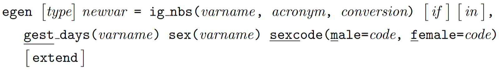
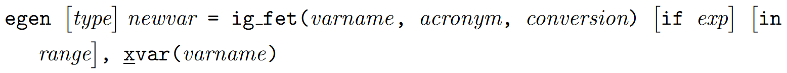

# gigs: Fetal, neonatal and infant growth assessment in Stata
<!-- badges: start -->
[](https://www.repostatus.org/#active)
<!-- badges: end -->

## About
Produced as part of the Guidance for International Growth Standards (GIGS) 
project, `gigs` provides a single, simple interface for working with the WHO 
Child Growth Standards and outputs from the INTERGROWTH-21<sup>st</sup> project.
You will find functions for converting between anthropometric measures (e.g. 
weight or length) to z-scores and centiles, and the inverse. Also included are 
functions for classifying newborn and infant growth according to 
literature-based cut-offs.

## Installation
The `gigs` package is available for Stata version 16 and over. You can install
the latest stable release of `gigs` from GitHub using the 
[`github` module](https://haghish.github.io/github/) for Stata:
```stata
. github install lshtm-gigs/gigs-stata
```

Alternatively, you can download a stable release of your choice from GitHub 
using the `net install` command from Stata. Simply go to the **stable release**
of `gigs` that  you want to download from the 
[releases](https://github.com/lshtm-gigs/gigs-stata/releases/) page on GitHub, 
and download the zipped archive. Unzip this downloaded archive. Within this 
unzipped folder will be another folder, inside which will be the `.ado`/`.dta` 
files needed for `gigs` to work. Put the path to the folder containing the 
`.ado`/`.dta` files in the `from()` option of `net install`, and Stata will
install the necessary files.
```stata
. net install gigs, from("directory/of/unzipped/folder/with/ado/files")
```

## Available standards
* `ig_nbs` - INTERGROWTH-21<sup>st</sup> standards for newborn size
  <details>
  <summary>
  Component standards
  </summary>

  | Acronym  | Description                                | Unit  | `gest_days()` range |
  |----------|--------------------------------------------|-------|---------------------|
  | `wfga`   | Weight-or-gestational age                  | kg    | 168 to 300 days     |
  | `lfga`   | Length-for-gestational age                 | cm    | 168 to 300 days     |
  | `hcfga`  | Head circumference-for-gestational age     | cm    | 168 to 300 days     |
  | `wlrfga` | Weight-to-length ratio-for-gestational age | kg/cm | 168 to 300 days     |
  | `ffmfga` | Fat-free mass-for-gestational age          | kg    | 266 to 294 days     |
  | `bfpfga` | Body fat percentage-for-gestational age    | %     | 266 to 294 days     |
  | `fmfga`  | Fat mass-for-gestational age               | kg    | 266 to 294 days     |

  </details>
- `ig_png` - INTERGROWTH-21<sup>st</sup> standards for postnatal growth in
  preterm infants
  <details>
  <summary>
  Component standards
  </summary>
  
  | Acronym | Description                | Unit | `xvar()` range      |
  |---------|----------------------------|------|---------------------|
  | `wfa`   | weight-for-age             | kg   | 27 to ≤64 weeks PMA |
  | `lfa`   | length-for-age             | cm   | 27 to ≤64 weeks PMA |
  | `hcfa`  | head circumference-for-age | cm   | 27 to ≤64 weeks PMA |
  | `wfl`   | weight-for-length          | kg   | 35 to 65 cm         |

  </details>
* `ig_fet` - INTERGROWTH-21<sup>st</sup> fetal standards
  <details><summary>Component standards</summary>

  | Acronym   | Description                                                  | Unit  | `x` range       |
  |-----------|--------------------------------------------------------------|-------|-----------------|
  | `hcfga`   | head circumference-for-GA                                    | mm    | 98 to 280 days  |
  | `bpdfga`  | biparietal diameter-for-GA                                   | mm    | 98 to 280 days  |
  | `acfga`   | abdominal circumference-for-GA                               | mm    | 98 to 280 days  |
  | `flfga`   | femur length-for-GA                                          | mm    | 98 to 280 days  |
  | `ofdfga`  | occipito-frontal diameter for-GA                             | mm    | 98 to 280 days  |
  | `efwfga`  | estimated fetal weight-for-GA                                | grams | 154 to 280 days |
  | `sfhfga`  | symphisis-fundal height-for-GA                               | mm    | 112 to 294 days |
  | `crlfga`  | crown-rump length-for-GA                                     | mm    | 58 to 105 days  |
  | `gafcrl`  | GA-for-crown-rump length                                     | days  | 15 to 95 mm     |
  | `gwgfga`  | gestational weight gain-for-GA                               | kg    | 98 to 280 days  |
  | `pifga`   | pulsatility index-for-GA                                     |       | 168 to 280 days |
  | `rifga`   | resistance index-for-GA                                      |       | 168 to 280 days |
  | `sdrfga`  | systolic/diastolic ratio-for-GA                              |       | 168 to 280 days |
  | `tcdfga`  | transcerebellar diameter-for-GA                              | mm    | 98 to 280 days  |
  | `gaftcd`  | GA-for-transcerebellar diameter                              | days  | 12-55 mm        |
  | `poffga`  | parietal-occipital fissure-for-GA                            | mm    | 105 to 252 days |
  | `sffga`   | Sylvian fissue-for-GA                                        | mm    | 105 to 252 days |
  | `avfga`   | anterior horn of the lateral ventricle-for-GA                | mm    | 105 to 252 days |
  | `pvfga`   | atrium of the posterior horn of the lateral ventricle-for-GA | mm    | 105 to 252 days |
  | `cmfga`   | cisterna magna-for-GA                                        | mm    | 105 to 252 days |
  | `hefwfga` | Hadlock estimated fetal weight-for-GA                        | g     | 126 to 287 days |
  
  </details>
- `who_gs` - WHO Child Growth Standards for term infants
  <details>
  <summary>
  Component standards
  </summary>
  
  | Acronym | Description                  | Unit             | `xvar()` range  |
  |---------|------------------------------|------------------|-----------------|
  | `wfa`   | weight-for-age               | kg               | 0 to 1856 days  |
  | `bfa`   | BMI-for-age                  | kg/m<sup>2</sup> | 0 to 1856 days  |
  | `lhfa`  | length/height-for-age        | cm               | 0 to 1856 days  |
  | `hcfa`  | head circumference-for-age   | cm               | 0 to 1856 days  |
  | `wfl`   | weight-for-length            | kg               | 45 to 110 cm    |
  | `wfh`   | weight-for-height            | kg               | 65 to 120 cm    |
  | `acfa`  | arm circumference-for-age    | cm               | 91 to 1856 days |
  | `ssfa`  | subscapular skinfold-for-age | mm               | 91 to 1856 days |
  | `tsfa`  | triceps skinfold-for-age     | mm               | 91 to 1856 days |

  </details>

## Conversion functions
Each conversion function has similar syntax. The main function call determines
the set of standards in use, the `acronym` parameter specifies which component 
standard is being used, and the `conversion` parameter specifies the type of 
conversion you wish to perform. This `conversion` parameter can take one of four
values: `"v2z"` (value-to-z-score), `"v2c"` (value-to-centile), `"z2v"` 
(z-score-to-value), `"c2v"` (centile-to-value). The `sex()` and `sexcode()` 
options supply the non-fetal functions with sex data - without this, these
sex-specific growth standards cannot be applied.

### INTERGROWTH-21<sup>st</sup> Newborn Size standards, including very preterm
This function can be used to convert between measurements and 
z-scores/centiles in each of the INTERGROWTH-21<sup>st</sup> Newborn Size
Standards. 



### INTERGROWTH-21<sup>st</sup> Postnatal Growth standards
This function can be used to convert between measurements and z-scores/centiles
in each of the INTERGROWTH-21<sup>st</sup> Postnatal Growth of Preterm Infants
Standards.


### INTERGROWTH-21<sup>st</sup> Fetal Growth standards
This function can be used to convert between measurements and z-scores/centiles
in each of the INTERGROWTH-21<sup>st</sup> Fetal standards.



### WHO Child Growth Standards
This function can be used to convert between measurements and z-scores/centiles
in each of the WHO Child Growth Standards.


### Classification functions
These functions are used to classify infant growth according to published
cut-offs. These publications are discussed in the attached [paper](). 

#### Size for gestational age


This function outputs a variable with the following values and labels. Severely
SGA infants are only labelled if the `severe` option is specified:

| Value | Meaning                               | Centile range                      |
|-------|---------------------------------------|------------------------------------|
| -2    | Severely small for gestational age    | <3<sup>rd</sup>                    |
| -1    | Small for gestational age (SGA)       | <10<sup>th</sup>                   |
| 0     | Appropriate for gestational age (AGA) | 10<sup>th</sup> to 90<sup>th</sup> |
| 1     | Large for gestational age (LGA)       | \>90<sup>th</sup>                  |

#### Small vulnerable newborns


This function outputs a variable with the following values and labels:

| Value | Meaning     | Term Status | Centile range                      |
|-------|-------------|-------------|------------------------------------|
| -4    | Preterm SGA | Preterm     | <10<sup>th</sup>                   |
| -3    | Preterm AGA | Preterm     | 10<sup>th</sup> to 90<sup>th</sup> |
| -2    | Preterm LGA | Preterm     | \>90<sup>th</sup>                  |
| -1    | Term    SGA | Term        | <10<sup>th</sup>                   |
| 0     | Term    AGA | Term        | 10<sup>th</sup> to 90<sup>th</sup> |
| 1     | Term    LGA | Term        | \>90<sup>th</sup>                  |


#### Stunting


The function outputs a variable with the following values and labels. Outlier
observations are only labelled if the `outliers` option is specified:

| Value | Meaning         | Z-score range |
|-------|-----------------|---------------|
| -2    | Severe stunting | -5 to -3      |
| -1    | Stunting        | -3 to -2      |
| 0     | Not stunting    | -2 to 5       |
| -10   | Implausible     | \<-5 or \>5   |

#### Wasting


The function outputs a variable with the following values and labels. Outlier
observations are only labelled if the `outliers` option is specified:

| Value | Meaning        | Z-score range |
|-------|----------------|---------------|
| -2    | Severe wasting | -5 to -3      |
| -1    | Wasting        | -3 to -2      |
| 0     | Not wasting    | -2 to 2       |
| 1     | Overweight     | 2 to 5        |
| -10   | Implausible    | \<-5 or \>5   |

#### Weight-for-age


The function outputs a variable with the following values and labels. Outlier
observations are only labelled if the `outliers` option is specified:

| Value | Meaning              | Z-score range |
|-------|----------------------|---------------|
| -2    | Severely underweight | -6 to -3      |
| -1    | Underweight          | -3 to -2      |
| 0     | Normal weight        | -2 to 2       |
| 1     | Overweight           | 2 to 5        |
| -10   | Implausible          | \<-6 or \>5   |

## Examples
This section illustrates a possible use case using `life6mo.dta`, an extract of
data from the Low birthweight Infant Feeding Exploration (LIFE) Study. It 
contains weight measurements for term and preterm infants from birth 
(`visitweek == 0`) to around six months of age (`visitweek == 26`).

```stata
. use life6mo, clear
. keep id gestage sex visitweek pma age_days weight_g
. local 37weeks 7 * 37
. list in f/9, noobs abbreviate(10) sep(9)
 __________________________________________________________
|  id  gestage  sex visitweek   pma   age_days   weight_g  |
|   1      273    1         0   273          0   2300      |
|   1      273    1         1   280          7   2185      |
|   1      273    1         2   288         15   2325      |
|   1      273    1         4   301         28   2575      |
|   1      273    1         6   316         43   3410      |
|   1      273    1         10  344         71   4262.3333 |
|   1      273    1         14  376        103   5050      |
|   1      273    1         18  399        126   5431.6667 |
|   1      273    1         26  460        187   5835      |
 ‾‾‾‾‾‾‾‾‾‾‾‾‾‾‾‾‾‾‾‾‾‾‾‾‾‾‾‾‾‾‾‾‾‾‾‾‾‾‾‾‾‾‾‾‾‾‾‾‾‾‾‾‾‾‾‾‾‾
```

### Conversion
We can use the conversion functions listed above to generate weight-for-age 
z-scores (WAZs) in the different study populations (i.e. term vs preterm) and 
measurement  timings (i.e. z-scores for newborns with 
INTERGROWTH-21<sup>st</sup> Newborn Size Standards, WHO/INTERGROWTH Postnatal 
standards after birth).

```stata
. egen double waz_nbs = ig_nbs(weight_g/1000, "wfga", "v2z") ///
>     if age_days == 0, ///
>     gest_days(gestage) sex(sex) sexcode(m=1, f=2)
(2,432 missing values generated)

. egen double waz_who = who_gs(weight_g/1000, "wfa", "v2z") ///
>     if age_days > 0 & gestage >= `37weeks´, ///
>     xvar(age_days) sex(sex) sexcode(m=1, f=2)
(1,360 missing values generated)

. gen pma_weeks = pma / 7
. egen double waz_png = ig_png(weight_g/1000, "wfa", "v2z") ///
>     if age_days > 0 & gestage < `37weeks´, ///
>     xvar(pma_weeks) sex(sex) sexcode(m=1, f=2)
(1,463 missing values generated)
. drop pma_weeks
```

We can then combine these WAZs into one overall `waz` variable:

```stata
. gen double waz = waz_who if gestage > `37weeks´
(1,508 missing values generated)
. replace waz = waz_png if gestage < `37weeks´
(1,026 real changes made)
. replace waz = waz_nbs if age_days == 0
(57 real changes made)

. list visitweek gestage pma waz_* waz in f/9, noobs sep(9)
 ____________________________________________________________________
| visitw~k  gestage  pma    waz_nbs      waz_who  waz_png        waz |
|        0      273  273  -2.298544            .        .  -2.298544 |
|        1      273  280          .    -3.028356        .  -3.028356 |
|        2      273  288          .   -3.2685948        . -3.2685948 |
|        4      273  301          .   -3.6824586        . -3.6824586 |
|        6      273  316          .   -2.7962372        . -2.7962372 |
|       10      273  344          .   -2.5495876        . -2.5495876 |
|       14      273  376          .   -2.3102437        . -2.3102437 |
|       18      273  399          .   -2.3030732        . -2.3030732 |
|       26      273  460          .   -2.8157742        . -2.8157742 |
 ‾‾‾‾‾‾‾‾‾‾‾‾‾‾‾‾‾‾‾‾‾‾‾‾‾‾‾‾‾‾‾‾‾‾‾‾‾‾‾‾‾‾‾‾‾‾‾‾‾‾‾‾‾‾‾‾‾‾‾‾‾‾‾‾‾‾‾‾
```

This `waz` variable can then be used to determine whether infants are 
underweight at different age points, or to track the growth trajectory of
individual children.

### Classification
This dataset contains information on weight at birth, so could be used to 
calculate size-for-gestational age classifications. We can reload the data, then
remove any observations which were not made at birth. We then use the 
`classify_sfga()` command to give us our classifications:
```stata
. use life6mo, clear
. keep if age_days == 0
(2,432 observations deleted)

. egen sfga = classify_sfga(weight_g/1000), ///
>     gest_days(gestage) sex(sex) sexcode(m=1, f=2)

. tab sfga

       sfga |      Freq.     Percent        Cum.
------------+-----------------------------------
        SGA |         39       68.42       68.42
        AGA |         16       28.07       96.49
        LGA |          2        3.51      100.00
------------+-----------------------------------
      Total |         57      100.00
```

## Known issues and bug reporting
We request that users note any bugs, issues, or feature requests on the GitHub 
[issues page](https://github.com/lshtm-gigs/gigs-stata/issues).

Authors
------
  **S. R. Parker**  
  Maternal, Adolescent, Reproductive, and Child Health Centre  
  London School of Hygiene and Tropical Medicine
  
  **Dr E. O. Ohuma**  
  Maternal, Adolescent, Reproductive, and Child Health Centre  
  London School of Hygiene and Tropical Medicine
